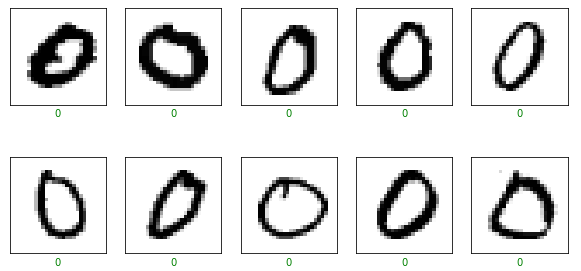
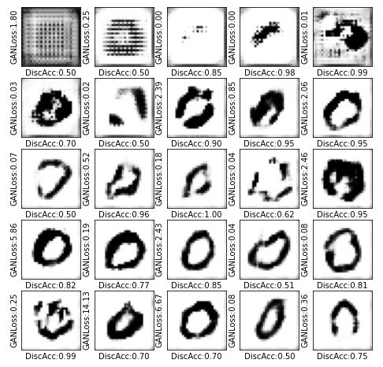

# DCGAN-MNIST
Implementing a Deep Convolutional GAN training the network to generate realistic looking synthesized images.
The term Deepfake is typically associated with this type of synthetic data which is similar to real world observed data often with synthesized images, videos or audio.
Here, I am using relatively small dataset to ensure a reasonable computation cost on which the dataset is used as of MNIST Handwritten digits.

## The following images were used to train the GAN from the MNIST dataset 

## And the following images were synthesized after training the network

For better understanding:
https://medium.com/@ramyahrgowda/dcgan-implementation-in-keras-explained-e1918fc930ea